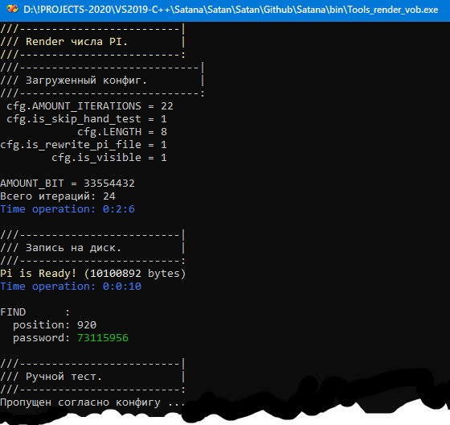
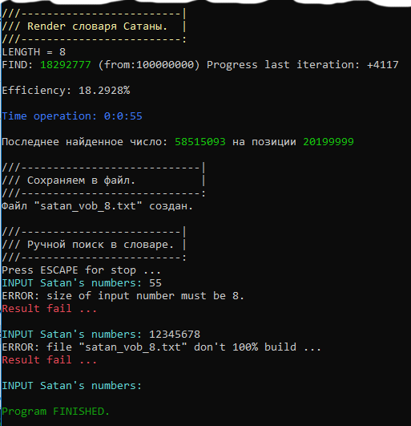

# 3.14 of Satan

Тема на киберфоруме:
[www.cyberforum.ru](https://www.cyberforum.ru/contests/thread2787489.html)
 
:one: Был использован алгоритм `Брента — Саламина`. Программа сначала писалась под `MSYS10 + GMP`, пока не стало ясно, что точности long в `mpf_set_default_prec(AMOUNT_BIT)` для решения задачи не достаточно. Поэтому было принято решение переползти на MPIR, который очень хорошо дружит с VC++. Отсюда возник тандем `VC++2019 + MPIR`

:two: Конфиг `Config.txt` настроен на рендер `числа Пи` такого размера, которое могло бы содержать ВСЕ вхождения циферных последовательностей длиной `8`. Чтобы сгенерирвать число ПИ требуемого размера,
предположительно достаточно иметь в конфиге `AMOUNT_ITERATIONS  = 29`.

:three: После окончания генерации Пи и записи его в файл автоматичеcки стартует билдинг словаря Сатаны, предположительно он должен быть полным, то есть содержать ровно `100'000'000` записей согласно условию задачи.

:four: После генерации словаря будет запущен ручной тест поиска пароля по слову Сатаны. Пароль ищется в файле без его загрузки в память способом адресации по содержанию (или другими словами - способом индексации массива), т.е. с алгоритмической сложностью **O(1)** Внимание, поиск возможен только, если будет сгенерирован **`ПОЛНЫЙ(!) словарь`** содержащий ВСЕ записи, иначе программа предупредит вас об этом.

# Как оно выглядит:

# Файловая схема:

                            .----------------------. 
                            |       mylib.h        |
                            '----------------------'
                                        ^
                                        |
                                        |
                            .----------------------.
                            |       Config.h       |
                            '----------------------'
                                ^               ^
                                |               |
                                |               |
                |----------------------| |----------------------|
    START------>|       main.cpp       | | Tools_render_vob.cpp |
                |----------------------| |----------------------|