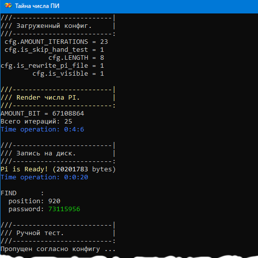

# Satana
 
1. Был использован алгоритм Брента — Саламина. Программа сначала писалась под MSYS10 + GMP, пока не стало ясно, что точности long в mpf_set_default_prec(AMOUNT_BIT) для решения задачи не достаточно. Поэтому было принято решение переползти на MPIR, который очень хорошо дружит с VC++. Отсюда возник тандем VC++2019 + MPIR

2. Конфиг Config.txt настроен рендер числи Пи такого размера, которое могло содержать ВСЕ вхождения циферных последовательностей длиной 8. Чтобы сгенерирвать число ПИ требуемого размера,
предположительно достаточно иметь в конфиге AMOUNT_ITERATIONS  = 22.

3. После окончания генерации Пи и записи его в файл автоматичеcки стартует билдинг словаря Сатаны, предположительно он должен быть полным, то есть содержать ровно 100'000'000 записей согласно условию задачи.

4. После генерации словаря будет запущен ручной тест поиска пароля по слову Сатаны. Пароль ищется в файле без его загрузки в память, т.е. с алгоритмической сложностью O(1) Внимание, поиск возможен только если будет сгенерирован полный словарь содержащий ВСЕ записи, иначе программа пердупредит вас об этом.

